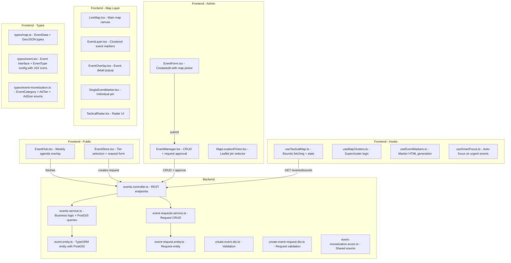
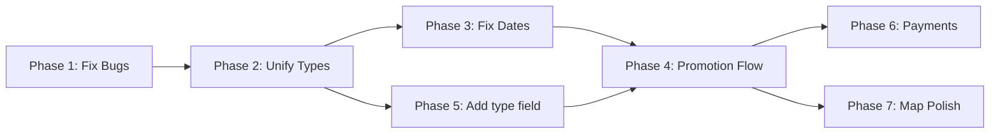

# Event Map System — Development Plan

## Current State Analysis

### Architecture Overview

The event map system spans **16 files** across frontend and backend:

---

## Critical Issues Found

### 1. THREE conflicting Event type definitions

| File | Type Name | Used By |
|------|-----------|---------|
| `types/map.ts` | `EventData` | LiveMap, EventLayer, EventOverlay, TacticalRadar, hooks |
| `types/event.tsx` | `Event` | EventManager, EventForm, api/events.ts |
| `types/event-monetization.ts` | enums only | EventStore |

**Problem**: `EventData` and `Event` have overlapping but different fields. `EventData` has `lat/lng` aliases, `banner`, `tags`, `kind`, `taxonomy`, `avatarId` that `Event` lacks. `Event` has strict category union types that `EventData` also has but as optional.

### 2. Missing `useMemo` import in EventHub.tsx

Line 22 of `EventHub.tsx` uses `useMemo` but it is NOT imported from React. This is a **runtime crash**.

### 3. Date field is a free-text string

The `date` column in `event.entity.ts` is `@Column() date: string` — storing display text like "Hoy, 5:00 PM". This makes it impossible to:
- Sort events chronologically
- Filter by date range
- Auto-expire past events
- Show "upcoming this week" reliably

### 4. Incomplete Request-to-Event promotion

In `EventManager.tsx` line 129-157, `handlePromote` creates a fake event object with `id: ''` and passes it to `EventForm`. The form then calls `onSubmit` which routes to `createMutation` only if `editingEvent` has no ID. This is fragile — the logic relies on checking `editingEvent.id` truthiness.

Additionally, when a request is approved, the `EventRequestsService.updateStatus()` does NOT auto-create the Event entity. The admin must manually fill the form and submit. There is no automatic coordinate assignment from the request.

### 5. Pricing inconsistency

- `EventStore.tsx` shows: Bronze = Free, Silver = 5000 CRC/day, Gold = 15000 CRC/day
- `events.service.ts` `getPricing()` returns: Bronze = $10, Silver = $25, Gold = $50 USD
- These are completely different pricing models and currencies

### 6. No payment flow exists

`EventRequest` entity has a `paymentMetadata` JSONB column but nothing writes to it. The Tilopay payment module exists but is not connected to event requests.

### 7. `type` field not persisted in backend

`EventForm.tsx` sends a `type` field (eco, social, concert, etc.) but the backend `Event` entity has no `type` column. It only has `category` (enum). The frontend `EventManager` has a `getEventTypeFromCategory()` mapper as a workaround, but this means the visual type is lost on round-trip.

---

## Development Plan

### Phase 1: Fix Critical Bugs

**Files to modify:**
- `frontend/src/components/EventHub.tsx` — Add missing `useMemo` import
- `frontend/src/components/admin/views/EventManager.tsx` — Fix promote flow ID check

**Tasks:**
1. Add `import { useMemo } from 'react'` to EventHub.tsx line 1
2. Refactor `handlePromote` to use a separate `initialValues` state instead of faking an event with empty ID

---

### Phase 2: Unify Type System

**Goal:** Single source of truth for event types across the entire frontend.

**Files to modify:**
- `frontend/src/types/event.ts` — NEW canonical file (rename from .tsx, separate JSX)
- `frontend/src/types/map.ts` — Make `EventData` extend or alias the canonical `Event`
- `frontend/src/types/event-monetization.ts` — Keep as-is (already clean)
- `frontend/src/types/event.tsx` — Rename to `event-type-config.tsx` (only JSX icon config)

**Tasks:**
1. Create `types/event.ts` with a single canonical `Event` interface that merges all fields
2. Move `EVENT_TYPE_CONFIG` with JSX icons to `types/event-type-config.tsx`
3. Make `EventData` in `map.ts` an alias: `export type EventData = Event`
4. Update all imports across ~12 files

---

### Phase 3: Fix Date Handling

**Files to modify:**
- `backend/src/modules/events/entities/event.entity.ts` — Add `startDate: Date` column
- `backend/src/modules/events/dto/create-event.dto.ts` — Add `startDate` field
- `backend/src/modules/events/events.service.ts` — Sort by `startDate`, auto-expire logic
- `frontend/src/components/admin/views/EventForm.tsx` — Use date picker for `startDate`
- `frontend/src/components/EventHub.tsx` — Sort by actual date

**Tasks:**
1. Add `@Column({ type: 'timestamptz', nullable: true }) startDate: Date` to event entity
2. Keep `date: string` for backward compat display text
3. Add migration to populate `startDate` from existing data where parseable
4. Update service to order by `startDate DESC` and filter `WHERE startDate >= NOW()`
5. Update EventForm to include a proper date input that maps to `startDate`

---

### Phase 4: Complete Request-to-Event Promotion Flow

**Files to modify:**
- `backend/src/modules/events/event-requests.service.ts` — Add `approve()` method that auto-creates Event
- `backend/src/modules/events/events.controller.ts` — Add `PATCH /requests/:id/approve` endpoint
- `frontend/src/components/admin/views/EventManager.tsx` — Simplify approve flow

**Tasks:**
1. Add `approve(id: string, overrides?: Partial<CreateEventDto>)` to `EventRequestsService`
2. This method should: find request, create Event from request data, mark request APPROVED, return both
3. Add new endpoint `PATCH /events/requests/:id/approve` that accepts optional coordinate overrides
4. Frontend: "Aprobar" button calls approve endpoint directly; "Aprobar y Editar" opens form with prefilled data
5. Add coordinate fields (lat/lng) to `EventRequest` entity so users can suggest location

---

### Phase 5: Add `type` Field to Backend

**Files to modify:**
- `backend/src/modules/events/entities/event.entity.ts` — Add `type` column
- `backend/src/shared/enums/event-monetization.enum.ts` — Add `EventType` enum
- `backend/src/modules/events/dto/create-event.dto.ts` — Add `type` field
- `backend/src/modules/events/dto/update-event.dto.ts` — Add `type` field

**Tasks:**
1. Create `EventType` enum: eco, social, concert, gastronomy, adventure, fire, reggae, surf, art
2. Add `@Column({ type: 'enum', enum: EventType, nullable: true }) type: EventType` to entity
3. Add to DTOs with `@IsEnum(EventType) @IsOptional()`
4. Remove `getEventTypeFromCategory()` workaround from EventManager

---

### Phase 6: Align Pricing and Connect Payments

**Files to modify:**
- `frontend/src/components/events/EventStore.tsx` — Use API pricing
- `backend/src/modules/events/events.service.ts` — Fix pricing to match business rules
- `backend/src/modules/events/events.controller.ts` — Add `GET /events/pricing` endpoint
- `backend/src/modules/payments/tilopay.service.ts` — Add event payment method

**Tasks:**
1. Decide on single pricing model (CRC or USD) and update both frontend and backend
2. Add `GET /events/pricing` public endpoint
3. Frontend EventStore fetches pricing from API instead of hardcoding
4. When request is created with SILVER/GOLD tier, generate a Tilopay payment link
5. Store payment reference in `EventRequest.paymentMetadata`
6. Auto-approve request when payment webhook confirms success

---

### Phase 7: Map Integration Improvements

**Files to modify:**
- `frontend/src/hooks/map/useTacticalMap.ts` — Improve bounds-based loading
- `frontend/src/components/map/EventLayer.tsx` — Better cluster rendering
- `frontend/src/hooks/map/useMapClusters.ts` — Optimize for large datasets

**Tasks:**
1. Add debounced bounds-based event fetching (currently fetches on every map move)
2. Implement tier-based marker sizing (GOLD = large pulsing marker, SILVER = medium, BRONZE = small)
3. Add "click cluster to zoom" behavior
4. Show event count badge on clusters
5. Add category-based color coding to markers (use EventType colors from config)

---

## Execution Priority

**Phase 1** is a prerequisite — the app crashes without the `useMemo` fix.
**Phase 2** should come next to avoid cascading type errors in later phases.
**Phases 3 and 5** can be done in parallel (both are backend schema changes).
**Phase 4** depends on 3 and 5 being done.
**Phases 6 and 7** are independent enhancements after the core is solid.
