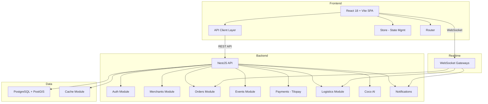

# Caribe Digital CR — Project Structure Analysis

## Overview
**Caribe Digital CR v2.0** is a hyper-local digital marketplace for Puerto Viejo, Costa Rica. It connects tourists with local merchants, events, logistics, and services.

## Tech Stack
| Layer | Technology |
|-------|-----------|
| **Frontend** | React 18 + Vite + TypeScript |
| **Backend** | NestJS + TypeORM + PostgreSQL |
| **Infra** | Docker Compose, Vercel, PowerShell scripts |
| **Monorepo** | Root `package.json` with `--prefix` scripts |

## Architecture (Monorepo)

```
caribe-digital-cr/
├── frontend/src/
│   ├── api/          # API client layer
│   ├── components/   # UI (admin views, events, merchants)
│   ├── hooks/        # Custom React hooks
│   ├── layouts/      # Page layouts
│   ├── pages/        # Route pages
│   ├── services/     # Business logic
│   ├── store/        # State management
│   ├── types/        # TypeScript types
│   ├── utils/        # Helpers
│   └── router.tsx    # Routing
│
├── backend/src/
│   ├── modules/      # 16 NestJS domain modules
│   │   ├── auth/         # Authentication + decorators
│   │   ├── blog/         # Blog posts
│   │   ├── cache/        # Caching layer
│   │   ├── coco-ai/      # AI assistant (knowledge base)
│   │   ├── emails/       # Email service
│   │   ├── events/       # Events + requests + monetization
│   │   ├── health/       # Health checks (+ emergency mode)
│   │   ├── legal/        # Legal compliance
│   │   ├── logistics/    # Courier missions + WebSocket gateway
│   │   ├── merchants/    # Merchant CRUD + audit + verification
│   │   ├── messages/     # Messaging + WebSocket
│   │   ├── notifications/# Push notifications + WebSocket
│   │   ├── orders/       # Orders + fulfillment + validation
│   │   ├── payments/     # Tilopay integration + webhooks
│   │   ├── products/     # Products + CABYS tax codes (CR)
│   │   ├── reviews/      # Review system
│   │   ├── rewards/      # Loyalty/rewards
│   │   ├── uploads/      # File uploads
│   │   └── users/        # Users + passkeys + roles
│   ├── shared/       # Enums, filters, seeders, utils
│   ├── scripts/      # DB scripts (seed, audit, truncate)
│   └── config/       # App configuration
│
├── backend_legacy/   # Old backend (kept for reference)
├── docs/             # Documentation
├── infrastructure/   # Deployment configs
└── plans/            # Planning docs
```

## Key Domain Modules (Backend)

| Module | Purpose | Notable |
|--------|---------|---------|
| **merchants** | Core business entity | Audit logging, verification flow, location subscriber |
| **orders** | Order lifecycle | Fulfillment service, validator, event-driven via paid/cancelled events |
| **events** | Local events | Request workflow, monetization enums, location subscriber |
| **payments** | Payment processing | Tilopay - CR payment gateway, webhook controller |
| **logistics** | Delivery/courier | Mission-based, WebSocket real-time tracking |
| **coco-ai** | AI chatbot | Knowledge base JSON, tools integration |
| **products** | Product catalog | CABYS entity - Costa Rica tax classification |

## Key Observations

1. **Real-time features**: 4 WebSocket gateways - logistics, messages, notifications, orders
2. **Costa Rica specific**: Tilopay payments, CABYS tax codes, legal module
3. **Event-driven**: Uses NestJS event emitter pattern - merchant status changes, order events
4. **Location-aware**: TypeORM subscribers for geo-data on users, merchants, events
5. **Emergency modes**: `app.module.emergency.ts` and `health.module.emergency.ts` suggest fallback configurations
6. **Legacy code**: `backend_legacy/` directory still present — potential cleanup target
7. **Heavy documentation**: Multiple `.md` planning files at root - PLAN, REFACTOR_PLAN, REMEDATION_PLAN, OPTIMIZATION_PLAN, etc.
8. **Utility scripts**: 12+ DB scripts for debugging/seeding — indicates active development/troubleshooting phase

## Potential Concerns

- **Duplicate type files**: `frontend/src/types/event.tsx` AND `event.ts` both exist
- **Legacy backend** still in repo adds confusion and bloat
- **Many root-level scripts** - .ps1 and .py files could be organized into a `scripts/` folder
- **No visible test framework** beyond `.http` files and manual JS test scripts
- **Root doc sprawl**: 10+ markdown files at root level could be consolidated into `docs/`

## Mermaid: High-Level Architecture


